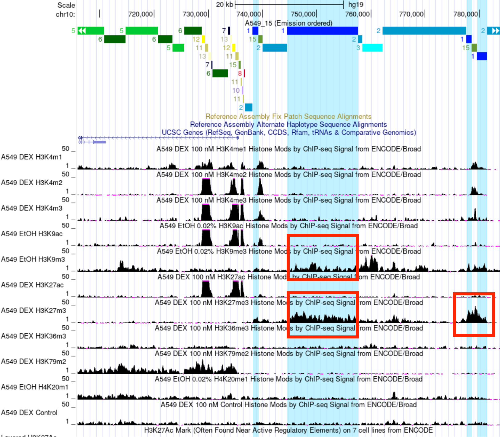

# hse_hw3_chromhmm

## Соответствие меток и файлов
| Метка       | Файл                |
| :-------------: |:------------------:|
| control     | wgEncodeBroadHistoneCd20ControlAlnRep1.bam    |
| H3K27ac     | wgEncodeBroadHistoneA549H3k27acDex100nmAlnRep1.bam    |
| H3K27me3     | wgEncodeBroadHistoneA549H3k27me3Dex100nmAlnRep1.bam    |
| H3K36me3     | wgEncodeBroadHistoneA549H3k36me3Dex100nmAlnRep1.bam    |
| H3K4me1     | wgEncodeBroadHistoneA549H3k04me1Dex100nmAlnRep1.bam    |
| H3K4me2     | wgEncodeBroadHistoneA549H3k04me2Dex100nmAlnRep1.bam   |
| H3K4me3     | wgEncodeBroadHistoneA549H3k04me3Dex100nmAlnRep1.bam    |
| H3K79me2     | wgEncodeBroadHistoneA549H3k79me2Dex100nmAlnRep1.bam    |
| H3K9ac     | wgEncodeBroadHistoneA549H3k09acEtoh02AlnRep1.bam    |
| H3K9me3     | wgEncodeBroadHistoneA549H3k09me3Etoh02AlnRep1.bam    |
| H4K20me1    | wgEncodeBroadHistoneA549H4k20me1Etoh02AlnRep1.bam    |

| Тип 1       | Тип 2                |
| :-------------: |:------------------:|
|      | wgEncodeBroadHistoneCd20ControlAlnRep1.bam    |
