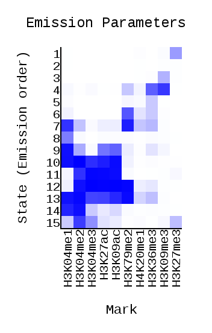
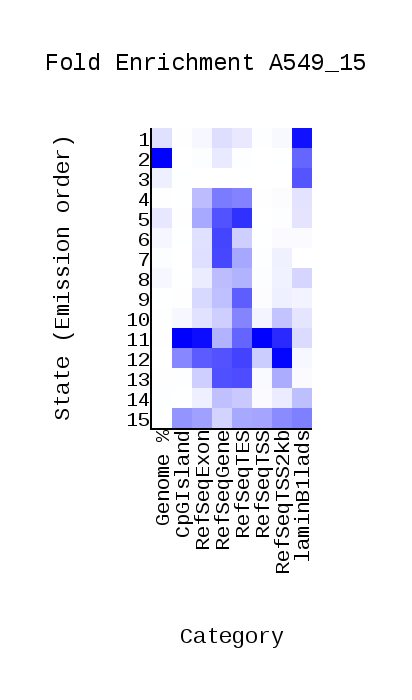
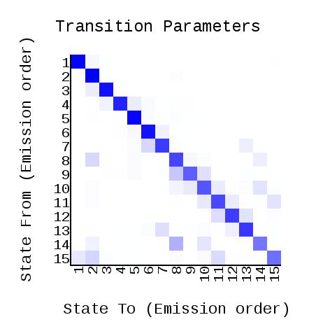
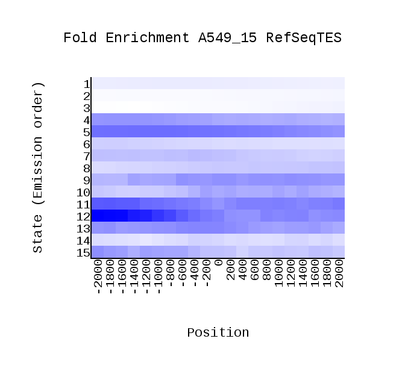
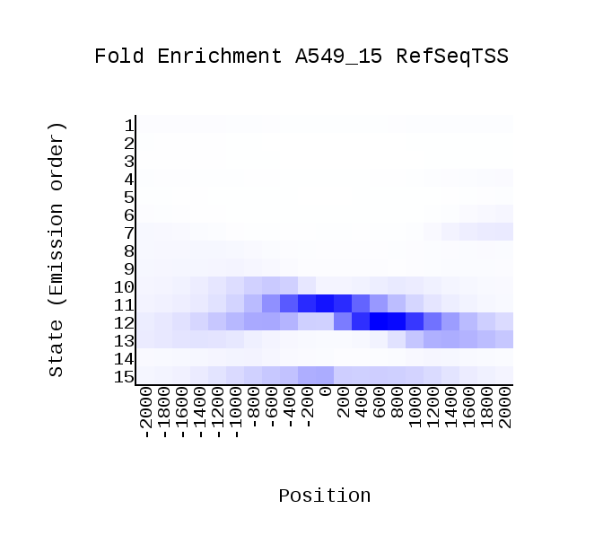

# hse_hw3_chromhmm

## Соответствие меток и файлов
| Метка       | Файл                |
| :-------------: |:------------------:|
| control     | wgEncodeBroadHistoneCd20ControlAlnRep1.bam    |
| H3K27ac     | wgEncodeBroadHistoneA549H3k27acDex100nmAlnRep1.bam    |
| H3K27me3     | wgEncodeBroadHistoneA549H3k27me3Dex100nmAlnRep1.bam    |
| H3K36me3     | wgEncodeBroadHistoneA549H3k36me3Dex100nmAlnRep1.bam    |
| H3K4me1     | wgEncodeBroadHistoneA549H3k04me1Dex100nmAlnRep1.bam    |
| H3K4me2     | wgEncodeBroadHistoneA549H3k04me2Dex100nmAlnRep1.bam   |
| H3K4me3     | wgEncodeBroadHistoneA549H3k04me3Dex100nmAlnRep1.bam    |
| H3K79me2     | wgEncodeBroadHistoneA549H3k79me2Dex100nmAlnRep1.bam    |
| H3K9ac     | wgEncodeBroadHistoneA549H3k09acEtoh02AlnRep1.bam    |
| H3K9me3     | wgEncodeBroadHistoneA549H3k09me3Etoh02AlnRep1.bam    |
| H4K20me1    | wgEncodeBroadHistoneA549H4k20me1Etoh02AlnRep1.bam    |

##ChromHMM output
| :-------------: | :------------------: | 
|  |  | 
|  |  |
|  |  |

##Naming
| Состояние       |  Тип               | Описание                | Название                |
| :-------------: | :------------------: | :------------------ | :------------------: |
| 1     |      |  <ul><li> чаще всего попадает на ядерную ламину</li><li>наиболее выражено (но слабо) на метке H3K27me3</li><li>в основном  локализуется в межгенном пространстве</li> | **Repressed** |
| 2     |      |  <ul><li> часто попадает на ядерную ламину</li><li> занимает бóльшую часть генома (%)</li><li>плохо выражено на всех метках</li><li>в основном  локализуется в межгенном пространстве и на интронах</li> | **Repressed** (возможно, Weak transcribed/Unmapable, так как низкий уровень emission frequency и высокий уровень self-transition) |
| 3     |      |  <ul><li> часто попадает на ядерную ламину</li><li>выражено на метке H3K9me3</li><li>в основном  локализуется в межгенном пространстве</li> | **Heterochromatin**  |
| 4     |      |  <ul><li> часто попадает на RefSeqTES, RefSeqGene, RefSeq Exon</li><li>выражено на метках H3K9me3, H3K36me3</li><li>локализуется на интроне или экзоне</li> | **Weak Transcribed**  |
| 5     |      |  <ul><li> часто попадает на RefSeqTES, RefSeqGene, RefSeq Exon</li><li>выражено на метке H3K36me3</li><li>локализуется на интроне или экзоне</li> | **Weak Transcribed**  |
| 6     |      |  <ul><li> попадает на RefSeqGene</li><li>выражено на метках H3K79me2, H3K36me3, H4K20me1</li><li>локализуется на интроне или экзоне</li> | **Weak Transcribed**  |
| 7     |      |  <ul><li> попадает на RefSeqTES, RefSeqGene, RefSeq Exon, также попадает на RefSeqTSS2kb</li><li>выражено на метках H3K04me1, H3K79me2, H3K36me3, H3K04me2</li><li>локализуется на интроне</li> | **Weak Enhancer**  (возможно, Weak promoter, так как попадает на Transcription start site, но смущает, что низкий уровень H3K04me3 (что более характерно как раз для энхансеров))  |
| 8     |      |  <ul><li> попадает на RefSeqTES, RefSeqGene, RefSeq Exon, также попадает на ядерную ламину, но редко</li><li>выражено на метке H3K04me1</li><li>локализуется на интроне рядом с экзоном</li> | **Weak Transcribed** |
| 9     |      |  <ul><li> попадает на RefSeqTES, RefSeqGene, RefSeq Exon, также попадает на ядерную ламину</li><li>выражено на метках H3K04me1, H3K09ac, H3K27ac, H3K04me2</li><li>локализуется на интроне</li> | **Weak Enhancer** |
| 10     |      |  <ul><li> попадает на RefSeqTES, RefSeqGene, RefSeq Exon, также попадает на RefSeqTSS2kb</li><li>выражено на метках H3K04me1, H3K04me2, H3K04me3, H3K09ac, H3K27ac</li><li>локализуется на интроне или жкзон</li> | **Weak Promoter**, так как попадает на Transcription start site и характерные метки имеют высокий уровень|
| 11     |      |  <ul><li> попадает на RefSeqTSS, RefSeqGene, CpgIslands, также попадает на RefSeqTSS2kb</li><li>выражено на метках H3K04me2, H3K04me3, H3K09ac, H3K27ac</li><li>локализуется на интроне или экзоне</li> | **Active Promoter**, так как попадает на Transcription start site и CpgIslands|
| 12     |      |  <ul><li> попадает на RefSeqTSS, RefSeqGene, CpgIslands, в основном попдает RefSeqTSS2kb</li><li>выражено на метках H3K04me2, H3K04me3, H3K09ac, H3K27ac, H3K79me2</li><li>локализуется на интроне или экзоне</li> | **Active Promoter**, так как попадает на Transcription start site и CpgIslands|
| 13     |      |  <ul><li> попадает на RefSeqTSS, RefSeqGene, CpgIslands, в основном попдает RefSeqTSS2kb</li><li>выражено на метках H3K04me1, H3K04me2, H3K04me3, H3K09ac, H3K27ac, H3K79me2</li><li>локализуется на интроне или экзоне</li> | **Strong Enhancer**, так как более низкий уровень H3K04me3 и в целом для характерных меток наблюдается высокий уровень частоты |
| 14     |      |  <ul><li> попадает на RefSeqTES, RefSeqGene, RefSeq Exon, также попадает на ядерную ламину, но редко</li><li>выражено на метках H3K04me1, H3K04me2, меньше на H3K04me3</li><li>локализуется на интроне</li> | **Weak Enhancer**|
| 15     |      |  <ul><li> попадает на CpgIslands, RefSeqTES, RefSeqGene, RefSeq Exon,  RefSeqTSS2kb, также попадает на ядерную ламину</li><li>выражено на метках H3K04me2, H3K04me3, меньше на H3K04me1</li><li>локализуется на интроне</li> | **Weak Promoter**|
